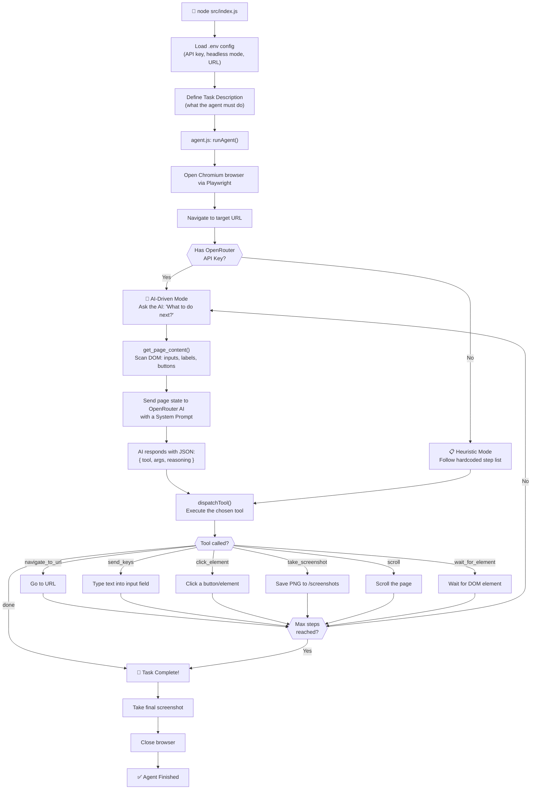

# 🤖 Website Automation Agent — Project Walkthrough

## What Is This Project?

A **Website Automation Agent** that uses AI to control a real web browser and complete tasks on websites — just like a human would. In this demo, it navigates to the **shadcn/ui** documentation page, finds a form, fills in fields with realistic data, clicks Submit, and takes screenshots at every step.

---

## 🧰 Tech Stack

| Technology | Role |
|---|---|
| **Node.js** | Runtime environment |
| **Playwright** | Controls the Chromium browser (clicks, scrolling, typing) |
| **OpenRouter API** | Routes requests to an AI model (GPT / Claude etc.) |
| **Winston + Chalk** | Structured logging to console and log files |
| **dotenv** | Loads environment variables from `.env` |
| **Axios** | Makes HTTP requests to the OpenRouter API |

---

## 📁 Project Structure

```
website-automation-agent/
├── .env                        ← API keys & config (never commit this!)
├── package.json
├── screenshots/                ← Agent saves images here at each step
├── logs/
│   ├── agent.log               ← Full structured log (JSON)
│   └── errors.log              ← Errors only
└── src/
    ├── index.js                ← Entry point — defines the task, starts the agent
    ├── agent/
    │   ├── agent.js            ← Core AI loop (the "brain")
    │   └── openRouterClient.js ← Talks to the AI model via OpenRouter
    ├── tools/
    │   └── browserTools.js     ← All browser actions (click, type, scroll, screenshot…)
    └── utils/
        └── logger.js           ← Colorized terminal + file logging
```

---

## 🔄 Full Workflow (Step by Step)



---

## 🧠 The Two Operating Modes

### Mode 1 — AI-Driven (with `OPENROUTER_API_KEY`)

Every step, the agent:
1. **Reads the live DOM** — collects all visible inputs, buttons, labels, and page text
2. **Sends that context to the AI** — along with the task description and conversation history
3. **AI replies with a JSON action** like:
   ```json
   {
     "tool": "send_keys",
     "args": { "selector": "input[name='username']", "text": "Mohit Sagar" },
     "reasoning": "Fill the Username field with the required sample data"
   }
   ```
4. **Agent executes it**, then loops back

This is called a **ReAct loop** — *Reason → Act → Observe → Repeat*.

### Mode 2 — Heuristic Fallback (no API key)

Runs a hardcoded ordered list of steps (`HEURISTIC_STEPS` in `agent.js`). No AI involved — just follows the script like a macro. Useful for demos without an internet connection.

---

## 📄 What Each File Does

### `src/index.js` — Entry Point
- Loads environment variables
- Defines the **task** as a plain English string
- Calls `runAgent()` to start everything

### `src/agent/agent.js` — The Brain
- Manages the **AI decision loop** (up to 20 steps)
- Decides whether to use AI or heuristic mode
- Calls `dispatchTool()` to map AI responses → browser actions
- Handles errors gracefully and logs every decision

### `src/agent/openRouterClient.js` — AI Gateway
- Sends HTTP requests to `https://openrouter.ai/api/v1/chat/completions`
- Passes the **system prompt** (tells AI it's a browser agent + what tools exist)
- Passes the **conversation history** (so AI has memory of past steps)
- Parses the AI's text response into a usable JSON action object

### `src/tools/browserTools.js` — The Hands
- Wraps **Playwright** into simple named functions
- Maintains a singleton `browserInstance` and `pageInstance`
- Each tool is independent and reusable:
  - `open_browser()` — launches Chromium
  - `navigate_to_url(url)` — goes to a page
  - `get_page_content()` — reads the DOM
  - `send_keys(text, selector)` — types into a field
  - `click_element(selector)` — clicks by CSS selector
  - `scroll(deltaY)` — scrolls up/down
  - `take_screenshot(label)` — saves a numbered PNG
  - `close_browser()` — cleanup

### `src/utils/logger.js` — Logging
- Uses **Winston** for structured logs (JSON to files)
- Uses **Chalk** for colorized terminal output
- Custom helpers: `agentAction()`, `agentThink()`, `agentSuccess()`, `agentError()`

---

## 🔑 Key Concepts to Highlight in Class

| Concept | Where it appears |
|---|---|
| **ReAct Agent Pattern** | `agent.js` — the Reason + Act loop |
| **Tool Use / Function Calling** | `dispatchTool()` + `browserTools.js` |
| **Prompt Engineering** | `SYSTEM_PROMPT` in `agent.js` |
| **Conversation Memory** | `conversationHistory` array passed to OpenRouter |
| **Graceful Degradation** | Heuristic fallback when no API key |
| **DOM Scraping** | `get_page_content()` using `page.evaluate()` |
| **Browser Automation** | Playwright controlling a real Chromium instance |
| **Environment Config** | `.env` + `dotenv` for secrets management |

---

## 🖼️ What Happens During a Run

1. Terminal shows step-by-step AI reasoning with 💭 and ✅ icons
2. A real Chrome window opens (if `HEADLESS=false`)
3. The agent navigates, scrolls, types, and clicks — all autonomously
4. Screenshots are saved to `/screenshots/` as numbered PNGs
5. Full logs saved to `/logs/agent.log` in JSON format

---

> [!TIP]
> **For your presentation:** Show the `/screenshots/` folder after a run — it tells the visual story of every step the agent took, making it very easy for your audience to follow along.
